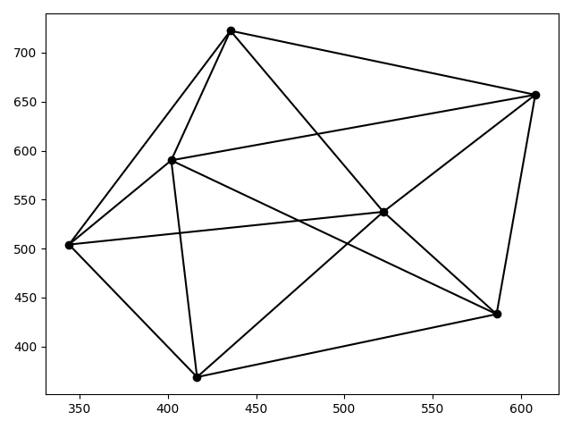
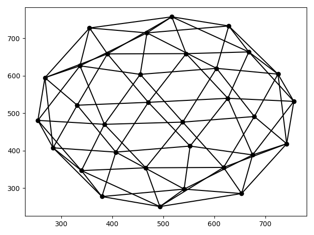

# Fruchterman-Reingold Python Implementation

## Screenshots

 
## To run
`python3 trabajo/practica6.py trabajo/grafos/papa.txt`
 
Thanks:
* The people at Department of Computer Science of the FCEIA
* [Graph Drawing by Force-Directed Placement](https://dcc.fceia.unr.edu.ar/sites/default/files/uploads/materias/fruchterman.pdf)
---
